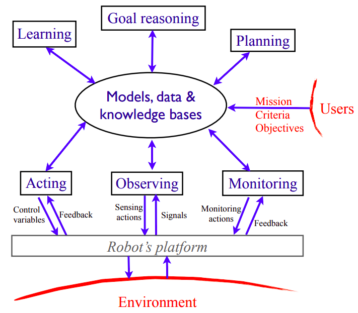
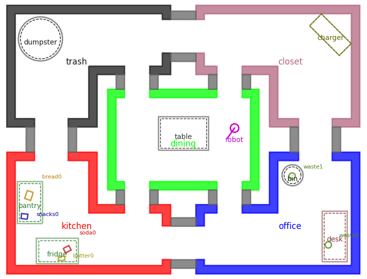
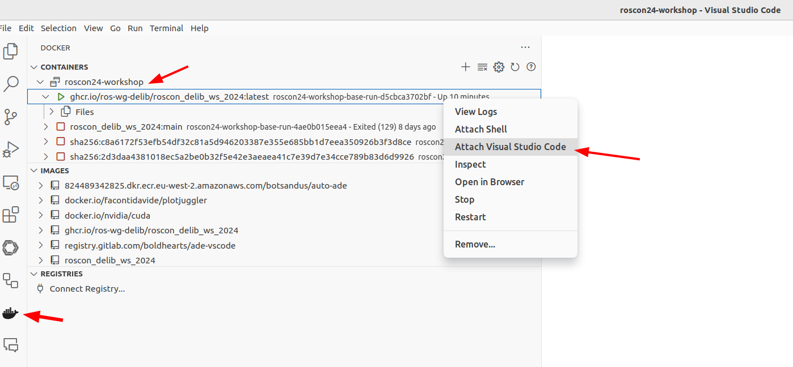

# Hands-On with ROS 2 Deliberation Technologies

This repository contains materials for the [ROSCon 2024](https://roscon.ros.org/2024/) workshop on ROS 2 Deliberation Technologies.
You can find the [slides here](https://drive.google.com/drive/folders/15H6QdkICynKpVlMn2Glz0ynS692LxZH8?usp=drive_link).

Deliberation in robotics refers to the collection of technologies necessary to create highly capable autonomous robots.
The key idea is the use of *models* of the robot and its environment to enable high-level decision-making for solving complex problems, as well as equipping robots with robust *skill representations* to successfully execute these tasks in the real world.

To learn more about deliberation, refer to [Ingrand and Ghallab (2017)](https://hal.science/hal-01137921).



*Overview diagram of robot deliberation, [Ingrand and Ghallab (2017)](https://hal.science/hal-01137921)*

---

## Technology Overview

In this hands-on workshop, you will get the opportunity to use a few ROS 2 enabled tools designed for robot deliberation.

This workshop uses [PyRoboSim](https://github.com/sea-bass/pyrobosim) as a simple 2D simulator with a ROS 2 interface to test our deliberation technologies.
PyRoboSim simulates mobile robots navigating across various locations, with the ability to detect and manipulate objects, and open and close locations.
Additionally, it can simulate failures and battery usage in the above actions.

* The [`problems`](./problems/README.md) folder contains information about the robotics problems you will solve in this workshop.
* The [`technologies`](./technologies/README.md) folder contains more detailed information on the deliberation software tools you will use to solve these problems.



---

## Setup

> [!NOTE]
> Please make sure you have completed the setup steps before arriving at the workshop.

### System Requirements

We highly recommend a host PC running Ubuntu 22.04 or 24.04.

If you are using macOS or Windows, you should install virtualization software such as [VirtualBox](https://www.virtualbox.org/) or [VMWare](https://www.vmware.com/products/desktop-hypervisor/workstation-and-fusion).
Then, set up an Ubuntu 22.04 or 24.04 virtual machine.

You also need to have Docker and Docker Compose installed on your system.
If you do not have these tools set up:

* Install Docker Engine using [these instructions](https://docs.docker.com/engine/install/ubuntu/).
  * **IMPORTANT:** Make sure you also go through the [Linux post-installation steps](https://docs.docker.com/engine/install/linux-postinstall/).
* Install Docker Compose using [these instructions](https://docs.docker.com/compose/install/).

Once you are able to run `docker` and `docker compose` commands without `sudo`, you can move on to the installation steps below.

```bash
docker run hello-world
docker compose --help
```

### Installation

First, open a terminal window and clone this repository and its submodules.

```bash
git clone --recurse-submodules https://github.com/ros-wg-delib/roscon24-workshop.git
```

Change into the repository folder (`cd roscon24-workshop`) and start the Docker container.

```bash
docker compose run base
```

> Note that this will initially download the Docker image and may take a few minutes
> for the download complete and the workspace to build.

After the container build finishes you will be in a bash shell.

Verify that you can launch a simulated world and the PyRoboSim UI appears on your screen.

```bash
ros2 run delib_ws_worlds run
```

*After* the initial build completes, you can open new terminals and attach to the currently running container from a different terminal using the command:

```bash
docker compose exec base bash
```

> Note: This command must be executed from the `roscon24-workshop` repository folder.

---

## Developing in the Container

By default, the whole ROS 2 workspace should have been built on setup.
However, you will need to rebuild your code as you develop new code or make changes to existing code.

We have created handy aliases that effectively wrap around `colcon build --symlink-install`:

* `delib_build` - Builds the entire workspace
* `delib_build_packages <package1> <package2> ...` - Builds specific packages
* `delib_build_packages_up_to <package>` - Builds all dependencies up to a specific package.
* `delib_clean` - Cleans up the entire workspace.

When you are ready to shut down the container, enter the following command from a terminal on your system:

```bash
docker compose down --remove-orphans
```

**NOTE:** If you want to clean up any containers and colcon build artifacts mounted to your host system (in the `.colcon` folder of this repo), you can run the following command.
It will ask you for your `sudo` password.

```bash
./clean_environment.sh
```

### Develop inside the container using VSCode

If you want to develop inside the container using VSCode, you need to have the [Docker extension](https://marketplace.visualstudio.com/items?itemName=ms-azuretools.vscode-docker) installed.
To see the option "Attach Visual Studio Code", you also need to download the [Dev Containers extension](https://marketplace.visualstudio.com/items?itemName=ms-vscode-remote.remote-containers).

Attach to the container as shown in the image below:



Once inside the container, open the folder `/delib_ws/src`.

---

## More information and troubleshooting

Once you are all set up, refer to the [cheatsheet](./CHEATSHEET.md) for more information, including useful commands and troubleshooting steps.
