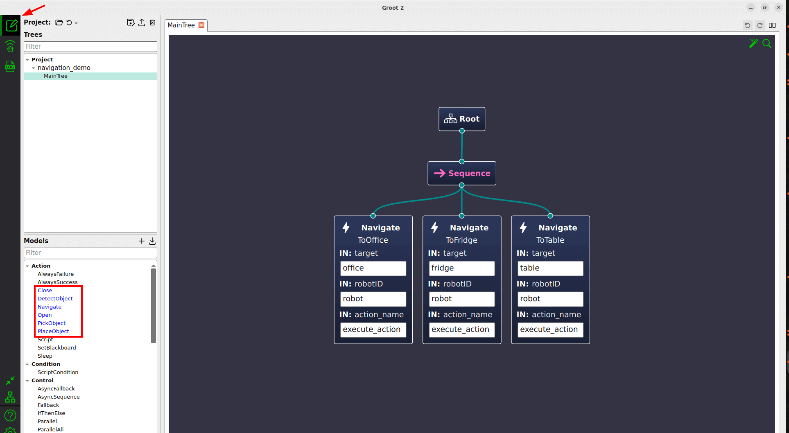

# BehaviorTree.CPP Nodes for ROSCon 2024 Deliberation Technologies Workshop

This package provides some ready to use Nodes (i.e. "actions") to be used with **pyrobosim**.

We suggest creating your XML trees in the folder `technologies/BehaviorTree.CPP/pyrobosim_btcpp/trees`

## How to compile

**Careful**: make sure to run this command in `/delib_ws` folder.

```bash
colcon build --symlink-install --packages-up-to pyrobosim_btcpp
```

## How to run

A BTCPP executor is provided to run Behavior Trees stored as XML files

For instance, consider this sample XML in [trees/navigation_demo.xml](pyrobosim_btcpp/trees/navigation_demo.xml)

```xml
<root BTCPP_format="4">

  <BehaviorTree ID="MainTree">
    <Sequence>
      <Navigate name="ToOffice" target="office"/>
      <Navigate name="ToFridge" target="fridge"/>
      <Navigate name="ToTable" target="table"/>
    </Sequence>
  </BehaviorTree>

</root>
```

NOTE: remember that the `name` attribute in the XML is optional and used for debugging only.

You can run the BehaviorTree with the command:

```bash
ros2 run pyrobosim_btcpp btcpp_executor --ros-args -p tree:=trees/navigation_demo.xml
```

The argument `tree` above is the path to the XML file. The path can be either:

- absolute,
- relative to the folder where the command is executed
- relative to the package folder, i.e. `technologies/BehaviorTree.CPP/pyrobosim_btcpp`.

## Action Nodes

| Action Name        | Description                                               | Input Port                            |
|--------------------|-----------------------------------------------------------|---------------------------------------|
| Close              | Close a door or a container                               | - location: name of the location      |
| DetectObject       | Return SUCCESS if the object is detected                  | - object: name of the object          |
| GetCurrentLocation | Store current location in the output port "location".     |                                       |
| Navigate           | Move to a specific location                               | - target: name of the location        |
| Open               | Open a door or a container                                | - object: name of the object          |
| PickObject         | Pick an object (you must be in front of it)               | - object: name of the object <br>- location: (optional) where the object is        |
| PlaceObject        | Place an object (you must hold it)                        | - object: name of the object <br>- location: (optional) where the object should go |

Note:

- the name of door between two rooms is called "hall_room1_room2". For instance "hall_office_kitchen" or "hall_dining_trash".
- names of openable/closable objects are "dumpster", "pantry", "desk" and "fridge".

## Condition Nodes

| Condition Name  | Description                                 | Input Port                                                       |
|-----------------|---------------------------------------------|------------------------------------------------------------------|
| isBatteryLow    | SUCCESS if {@battery_level} below threshold | - low_threshold: threshold to return SUCCESS. Default 20.0       |
| isBatteryFull   | SUCCESS if {@battery_level} above threshold | - full_threshold: threshold to return SUCCESS. Default 90.0      |

**Exercise**: try using the scripting language instead and the global variable `{@battery_level}` instead! See section below.

## Global Blackboard Values

These values of the blackboard can be accessed by any Tree / Subtree and are updated automatically and available in the **global blackboard**.

For more information about how "global blackboard" works, read [this tutorial](https://www.behaviortree.dev/docs/tutorial-advanced/tutorial_16_global_blackboard).

| Blackboard Key          | Type   |  Description                                              |
|-------------------------|--------|-----------------------------------------------------------|
| @battery_level          | float  | Battery level. Range (0.0 - 100.0)                        |
| @executing_action       | string | Identifier of the action being executed.                  |
| @holding_object         | bool   | True if the robot is holding an object                    |
| @last_visited_location  | string | Name of the last visited location, or where the robot is. |

## How to create / edit your XML files using Groot2

To launch Groot2, run the command:

```bash
/delib_ws/Groot2.AppImage
```

The application should start in "Editor Mode" (icon on top-left corner).
Click on "Load Project/File" and select `technologies/BehaviorTree.CPP/pyrobosim_btcpp/trees/roscon2024.btproj`

After clicking on "MainTree", you should see this:



In the "Project" section of the left, you can create multiple files, preferably one per problem.

If you want to play use Subtrees, you can create multiple trees inside the same file, but
remember to call "MainTree" the one that you want to be executed.

If you decide to use Subtrees, it is important that you read the
[Tutorial about port remapping](https://www.behaviortree.dev/docs/tutorial-basics/tutorial_06_subtree_ports) first.

### Groot2 Tips

1. The best way to learn the interface is by trying to double-click, right-click or drag-and-drop stuff :)

2. Remember that the text in the Ports are static strings. You you want to use the **blackboard**,
 use curly braces, as explained here. [Tutorial 2](https://www.behaviortree.dev/docs/tutorial-basics/tutorial_02_basic_ports)

3. There is a button (left bar, 3rd from bottom) to change the orientation of the tree.

4. To create a Subtree, right click on a Node and select "Create Subtree here".

5. If you don't want to deal with Port Remapping, just check the box **_autoremap**.
